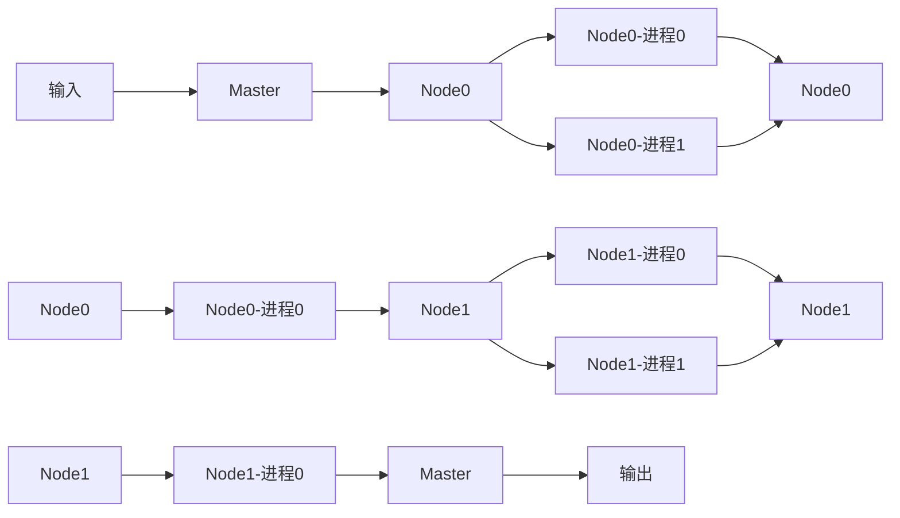
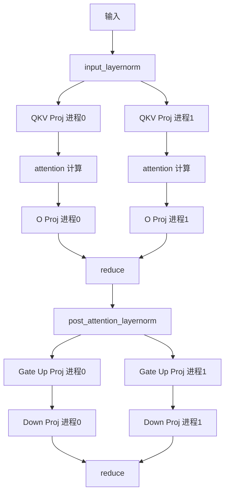
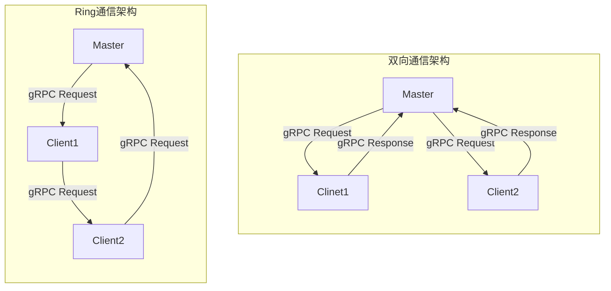

## together-LLM

跨机推理 LLM 框架

### RoadMap

#### backend

- [X] transformers
- [X] torch

#### communication

- [X] ray
- [X] torch.dist
- [X] rpc

http 耗时明显大于 rpc

ray 框架更易使用，无需手写 rpc 相关内容，且通信差不多，底层也是 rpc。

但 ray 框架在使用 Tensor Parallel 会比不开 TP 更快，故暂时先用 torch.dist，可以实现加速的效果。

torch.dist 在 CPU 机器上用 gloo（跨机或许也是用这个？）。

同时，使用 torch 的多进程共享内存进行 TP 也会更慢。

主要注意的是，reduce 涉及到一些复杂的规约算法，会有一些精度问题。

Q：为什么在单个 nn.Linear 使用 torch.dist 更快，但是在复杂模型中更慢？

A：可能是通信？内存不够？CPU不够？换 CUDA？

Q: 为什么 Merge QKV/gate、up 之后在复杂模型中更慢？

A：内存带宽？多核利用？换 CUDA 效果可能会变好？

在 `src2` 文件夹中，用 grpc 通信 PP，`torch.dist` 通信 TP。当前版本在实现的时候，没有通信 kv cache 和 position_ids，所以是有 bug 的。

在实现的时候，需要注意 grpc 只有一个进程能接收到请求，所以需要该进程同步输入至其他进程，以能够实现 `all.reduce`。有一些额外的通信开销，可以优化。

`torch.dist` 其实是有 rpc 模块的，所以`src3` 用 torch.dist.rpc 代替了 grpc 实现了跨机器通信，好处在于无需转换数据类型。用 torch.Tensor 通信即可。

#### parallel strategy

- [x] pipeline-parallel

PP 通信频率取决于 PP 个数。在使用 ray 实现 PP 策略时，发现难以实现预期的效果，故换用 RPC 的方式来实现 PP 策略。

- [x] tensor-parallel

TP 要求更高的通信频率，适合单机多卡/局域网。故使用 torch.dist 策略。

当 TP 和 PP 同时使用的时候，需要兼顾两种通信策略。在实现上，应该是先切 PP 再 TP 比较容易。

整体数据流如下：

输入会发送至 Master 节点，由 Master 节点发送至 Node0 中，由 Node0 同步数据至各个进程，计算完成后再汇总至进程 0，由Node0-进程0发送数据至下一个 Node。重复该流程直至最后一个 Node 完成，由最后一个 Node 的进程 0 发送至 Master 节点，最后由 Master 节点返回输出。

实现过程为了方便会有一定调整：

- Master 节点和 Node0 节点可能是一个节点
- Node0->Node1 的通信实现比较麻烦，暂时会由 Node1-> Master，再由 Master 发送至 Node1

单层 TP 的通信细节实现如下图所示，两个进程一直都存在。图中所示，对于`input_layernorm`两个进程的输入是一样，但都需要计算一次。计算后的输出也是一样，但是处于不不同的进程。不同的进程执行 attention 计算过程，最后对两个进程的 `O Proj` 的输出进行求和，再分发至两个进程。再执行`post_attention_layernorm`计算。MLP 的计算过程同理，最后对`Down Proj` 的输出进行求和，并分发至两个进程以输入至下一层。

经典的实现中 qkv proj 是分三层实现的 Q Proj,K Proj, V Proj，但是这里其实是可以并行，或者说合并为一层进行的，即 QKV Proj。Gate Up Proj 也是同理。具体实现可见 `linear_cases/parallel/merge_linear.py`

#### 节点间通信

### Performance

#### Pipeline Parallel (PP)

随着 PP 数变大，通信时间增大，所以单 token 时间变大

#### Tensor Parallel (TP)

在保证通信带宽的前提下，速度应当更快

| TP   | LLaMA3-8B | 34B | LLaMA3-70B |
| ---- | --------- | --- | ---------- |
| base |           |     |            |
| 2    | 1 token/ 10s|     |            |
| 4    |           |     |            |
| 8    |           |     |            |
|      |           |     |            |
