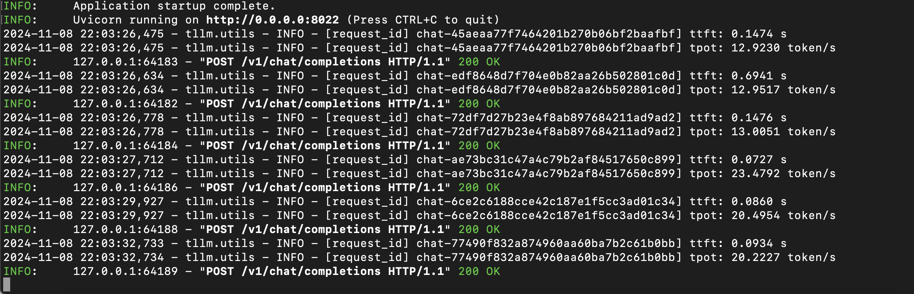
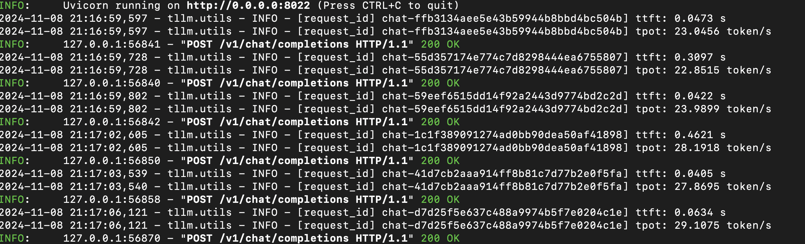
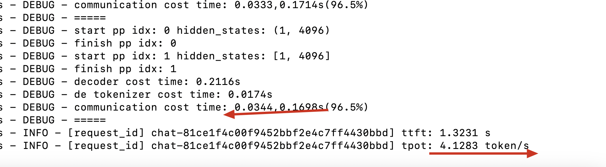

## together-LLM

跨机推理 LLM 框架

### QuickStart

1. download model from: https://huggingface.co/mlx-community/Llama-3.2-1B-Instruct-bf16

2. install dependencies

- for mlx:   `pip install -r requirements[mlx].txt`
- for intel: `pip install -r requirements.txt`

3. run server 

    `1` is the model size

    3.1 (no communication)

    - edit `examples/run_single_server.sh`

    ```bash
    bash examples/run_single_server.sh 1
    ```

    3.2 (with communication)

    - edit `examples/run_single_client.sh`

    - edit `examples/run.sh`

    ```bash
    # in one terminal
    bash examples/run.sh 1

    # in another terminal
    bash examples/run_single_client.sh 1
    ```

4. testing
```python
python benchmarks/run_async_requests.py
```

### RoadMap

使用 torch.dist 实现 张量并行，使用 rpc 实现流水并行，仅通信 hidden_states

- [ ] Speed Up
    - [x] Merge Linear
    - [x] Pipeline Parallel by grpc
    - [x] Tensor Parallel by torch.dist
    - [x] Sequence KV Cache
    - [x] Performance Testing
    - [ ] Support Flash Attention
- [x] Decoding Strategy
    - [x] Top-K Sampling
    - [x] Top-P Sampling
    - [x] Temperature Sampling
- [ ] Model
    - [x] LLaMA
    - [x] Qwen2
- [ ] split model before load
- [x] MLX Framework
    - [x] With Torch Inference
        - [x] Some bugs with multi requests
    - [x] Quantization
    - [x] MLX Server
    - [ ] LoRA Training
- [x] Web UI
    - [x] Node Status
        - [ ] Display Multi Model
    - [x] ChatWeb Demo by Gradio
        - [x] Parameters
        - [x] System
        - [x] Button
- [ ] Multi-Modal
    - [ ] Qwen2-VL (in progress, todo test input image)
- [x] Backend
    - [x] Client Send Url and Port
    - [ ] Auto Layer Split
        - [x] get free layer idx
        - [ ] calculate layer memory and recommend split
    - [x] Async Generation
        - [x] Multi-Sequence Batch=1
        - [x] Queuing mechanism
        - [x] Continuous Batch
        - [x] Test Cases
        - [x] Client Disconnect and Abort
    - [x] OpenAI API format
        - [x] Streaming Output
        - [x] chat completion(stream)
        - [x] chat completion(non-stream)
        - [x] using anythingLLM
    - [x] Communication
        - [x] Communication Time Benchmark
- [ ] KV Cache
    - [x] Request/Sequence Cache
    - [x] Custom KV Cache Class
    - [ ] Conversation KV Cache (in progress)
    - [ ] Token-Level Cache
        - [ ] Prefix-tree Cache
- [ ] Shard Storage

### Performance

### 网络要求估算

- PP=8 ，那么通信要求需要$*8$
- 70B 的 hidden_size 是 8192
- 数据是 `bfloat16`，每个 token 的通信参数量为 $1*8192*2=16,384$

在 TPOT 阶段预期速度: 20 token/s -> 0.05s / token
- 假设通信：计算比为 1:4，那么通信时间为 0.01s
    - 即每次通信要在 0.01/8s 完成，即 0.00125s-> 1.25ms
    - 当前实现为双向通信，70B 的 hidden_size 是 8192，就有 $16,384*2=32,768$ bytes.
    - 故要在 0.01/8s 完成，那么网络带宽至少要求 $32,768/0.01*8=26,214,400 bytes/s = 26 Mbps$。
在 TTFT 阶段，即首 token 时间预期 3s，
- 假设通信：计算比为 1:2，那么通信时间为 1s，即每次通信要在 1/8s 完成，即 0.125s -> 125ms
- 假设输入 token 数为 1000，那么通信参数量为 $1000*16,384 = 16,384,000$ bytes
- 1/8s 内完成，通信时间为 $16,384,000/1*8=131,072,000 比特/秒 = 131 Mbps$

优化点：
- ring 通信，加速一倍
- 数据压缩一倍，加速一倍
- 在 TTFT 阶段做 PP overlap，把输入 token 分块传输。

### 通信时间测试
token 数较少时压缩似乎效果不大，只有在大数据量的时候才有明显效果。

=== Starting gRPC Matrix Performance Test (use_zlib: False; use_lz4: False) ===

Time: 2024-11-02 11:40:40

| Matrix Shape   |   Transmission(ms) |   Compress(ms) |   Total(ms) |   Throughput(MB/s) |
| ---- | --------- | --- | --- | --- | 
| (1, 8192)      |              14.05 |           0.01 |       14.06 |               2.22 |
| (4, 8192)      |              29.89 |           0.01 |       29.90 |               4.18 |
| (16, 8192)     |              76.95 |           0.01 |       76.97 |               6.50 |
| (32, 8192)     |             137.05 |           0.01 |      137.06 |               7.30 |
| (64, 8192)     |             262.03 |           0.01 |      262.04 |               7.63 |

=== Starting gRPC Matrix Performance Test (use_zlib: False; use_lz4: True) ===

Time: 2024-11-02 11:51:41

| Matrix Shape   |   Transmission(ms) |   Compress(ms) |   Total(ms) |   Throughput(MB/s) |
| ---- | --------- | --- | --- | --- | 
| (1, 8192)      |              18.10 |           0.08 |       18.18 |               1.73 |
| (4, 8192)      |              30.82 |           0.19 |       31.01 |               4.06 |
| (16, 8192)     |              78.23 |           2.80 |       81.02 |               6.39 |
| (32, 8192)     |             136.85 |           5.62 |      142.47 |               7.31 |
| (64, 8192)     |             249.84 |          10.37 |      260.20 |               8.01 |

=== Starting gRPC Matrix Performance Test (use_zlib: True; use_lz4: False) ===

Time: 2024-11-02 11:41:51

| Matrix Shape   |   Transmission(ms) |   Compress(ms) |   Total(ms) |   Throughput(MB/s) |
| ---- | --------- | --- | --- | --- | 
| (1, 8192)      |              13.95 |           1.96 |       15.91 |               2.24 |
| (4, 8192)      |              32.74 |           9.82 |       42.56 |               3.82 |
| (16, 8192)     |              77.19 |          32.65 |      109.84 |               6.48 |
| (64, 8192)     |             256.25 |          83.67 |      339.92 |               7.80 |

### 分割线
- 2 GHz 四核Intel Core i5, 16 GB 3733 MHz LPDDR4X
    - Llama-3.2-1B-Instruct 单机时间：10.96 token/s
    - Llama-3.2-1B-Instruct 单机时间：5.73 token/s（包含首token生成的时间, transformers 框架 TTFT 时间不方便记录）

- Apple M3 Pro, 18 GB

在保证通信带宽的前提下，速度应当更快

由于 tokenizer 可能不同，所以输入 tokens 有一点出入，但基本差不多。

生成 token 速度（减去首token生成的时间）
bfloat 16 CPU
| PP,TP   | Llama-3.2-1B-Instruct | Llama-3.2-3B-Instruct |
| ---- | --------- | --- | 
| 2,1(实际) | 8.04 token/s | 3.01 token/s |
| 2,2(实际) | 7.38 token/s | 2.51 token/s |

包含首 token 生成时间
| PP,TP   | Llama-3.2-1B-Instruct | Llama-3.2-3B-Instruct |
| ---- | --------- | --- | 
| 2,1(实际) | 5.49 token/s  | 2.42 token/s  |
| 2,2(实际) | 5.66 token/s  | 2.46 token/s  |


TODO: Meta-Llama-3-8B-Instruct in GPU

- 多维数组实现（float32）: 单机通信在 0.002 s 左右 （seq-len=1）
- bytes 实现（float32）: 单机通信在 0.001 s 左右 （seq-len=1）


for 1b

- mac mini m2


- m3 pro


for 8b
- m3 pro (layer=8) + mac mini m2 (layer=24) 
